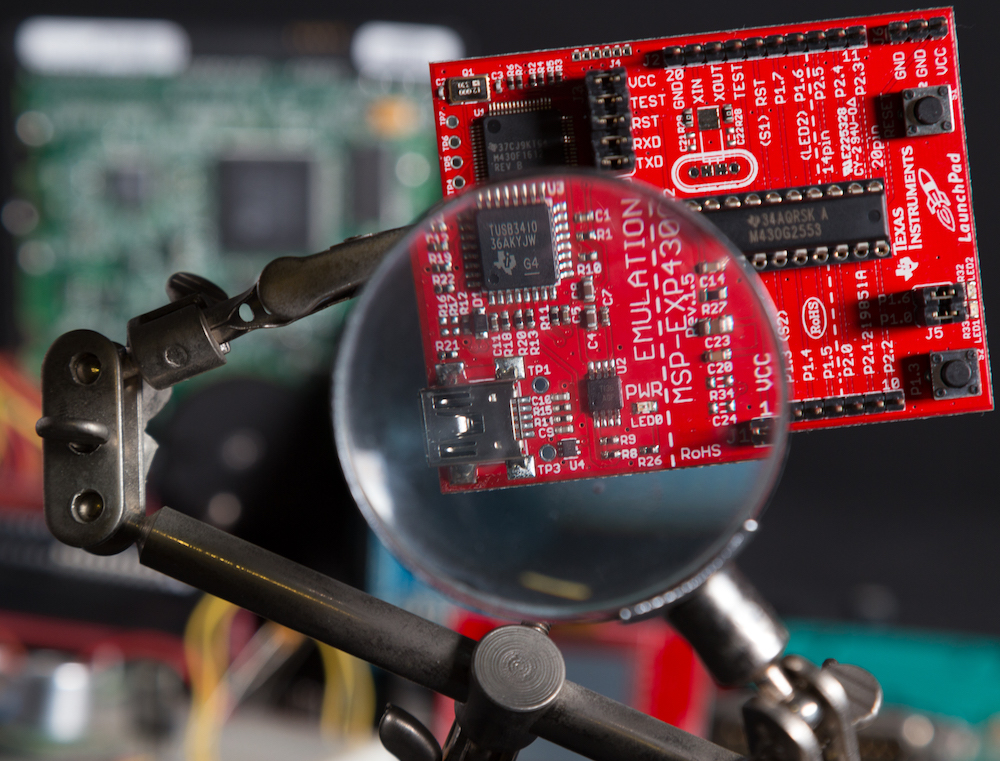
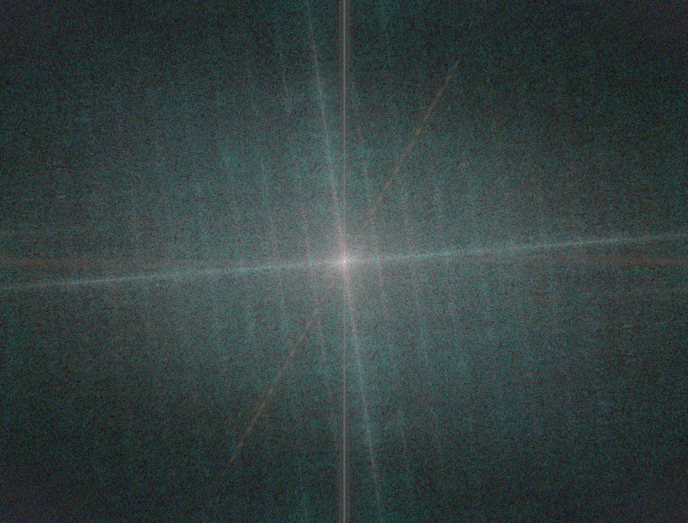
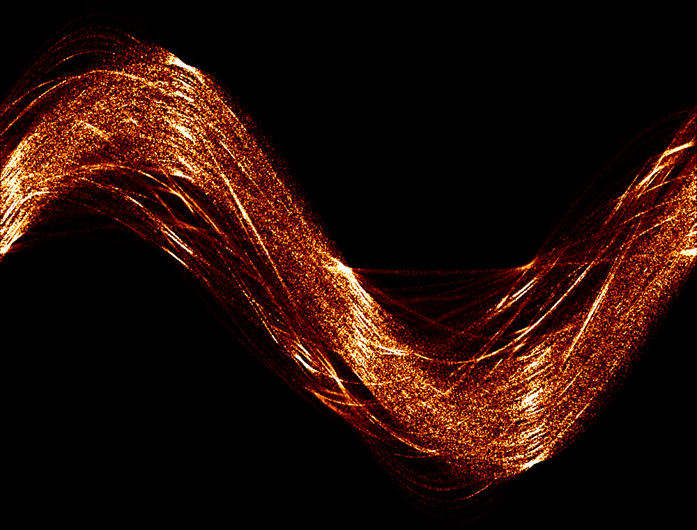
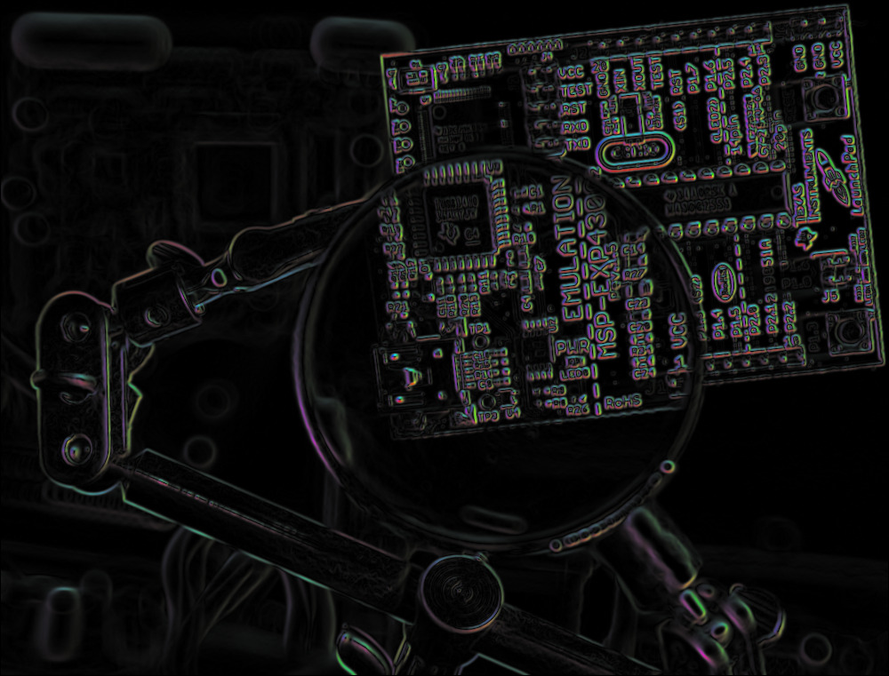
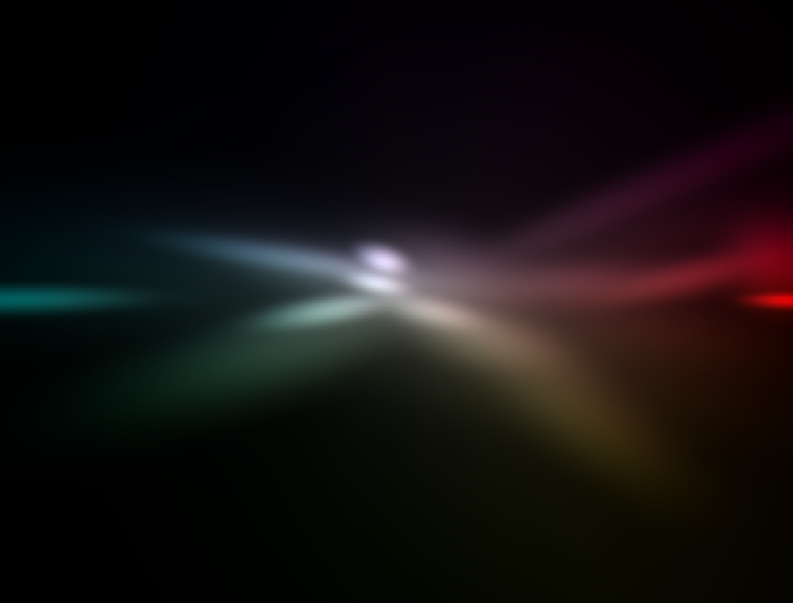

# An example


Consider this image.  It's a still life of a circuit board (a PIC USB
programmer, to be specific).  What we see is just one aspect of the image.
There are multiple ways to transform from the spatial domain (what we see) to
an alternate domain, like the frequency domain.  All of these transforms have
well-defined mathematical properties that tell us something very specific.

## Fourier Transform


The Fourier transform is probably the most straightforward of the transforms to
work with.  The 2D version does the exact same thing as its 1D counterpart does
for time-based signals: it transforms the signal into its frequency domain
representation.

This visualization applies the Fourier transform to each channel separately and
then computes the log-PSD (Power Spectrum Density).  More formally, if
`F(u,v)` is the image's Fourier transform, then the generated image is given
by `log(1 + ||F(u,v)||^2)`.

No windowing is performed so the image technically has spectral leakage.
Whether or not this is a problem depends on what you're trying to do and on the
content of the image.  The most obvious way this manifests is the appearance of
a cross-like response in the image's power spectrum.

## Hough Transform


The Hough transform is a mapping of an input space into some parameter space
where a location in the parameter space describes...something.  Usually that
something is a line, and since this is a line-based Hough transform, the
parameter space has coordinates of `(Θ, d)`.  That's because a line can be
written as `0 = cos(Θ)x + sin(Θ)y - d`, where `Θ` is the angle of the line's
normal and `d` is the shortest distance from the line to `(0, 0)`.



This particular Hough transform works with the image gradients directly, so
*no* edge detection was performed.  Instead, it works with gradient magnitudes
directly.  The algorithm is
```
accumulator = zeros(width, height)
for each pixel (x, y)
    compute the gradient (gx, gy)
    compute the angle Θ = atan2(gy, gx)
    compute the distance d = cos(Θ)x + sin(Θ)y
    accumulator(Θ, d) += ||gx^2 + gy^2||
```
It's noisier than if an edge detector was applied first.  However, since it's
being used for visualization, that's okay.  In fact, it makes the output image
a bit more interesting because you get structures from the *entire* image. You
don't need to tune the parameters of the edge detector to pull out weak edges,
for example.

## Hue/Saturation Space


The way to read the visualization is that colour (hue) is encoded as an angle
around the centre fo the image.  The centre of the image represents *no* colour,
so both black and white get mapped to the origin of the coordinate system.  The
farther out you go, the "more colour" you have (saturation).

The colour visualization is simultaneously simple and overly complicated.  The
idea here is to visualize the colour distribution on a what amounts to a colour
wheel.  The easiest way to do this is through an RGB to HSV colour conversion,
and then work with the hue and saturation colour channels.  Because hue is
defined as an angle, there's a polar-to-rectangular coordinate transform that
needs to happen, otherwise the results will appear off.

However, once you do this colour space mapping, you end up with a scatter plot,
not an image.  What's needed is a way to visualize the *density* of the colour
at any point on that colour wheel.  There are a variety of ways to do this, but
for the sake of processing time, `fr2r3` using scikit-learn's [BayesianGaussianMixture](https://scikit-learn.org/stable/modules/generated/sklearn.mixture.BayesianGaussianMixture.html#sklearn.mixture.BayesianGaussianMixture)
to estimate the scatter plot's mixture model.  It's effectively a stand-in for
a proper kernel density estimate, which is a fair bit slower than running the
GMM.

The exact process is:

1. Perform an RGB to HSV colour conversion.
2. Sample 10000 pixels from the input image.
3. Convert the pixels' hue-saturation coordinates from polar form to
   rectangular (i.e. Cartesian).
4. Train a GMM on the distribution in the hue-saturation space.
5. Find the likelihood of any point within the hue-saturation space under the
   GMM.
6. Perform an HSV to RGB colour conversion.

There are a few nuances that need to be accounted for (like avoiding invalid
saturation values), so please refer to the implementation for more details.
